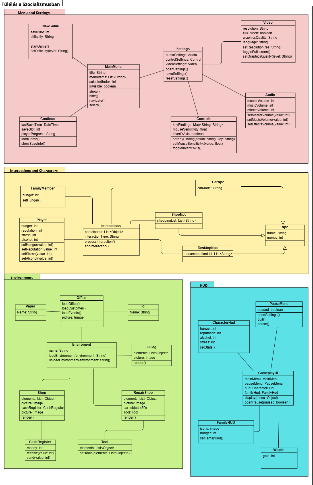
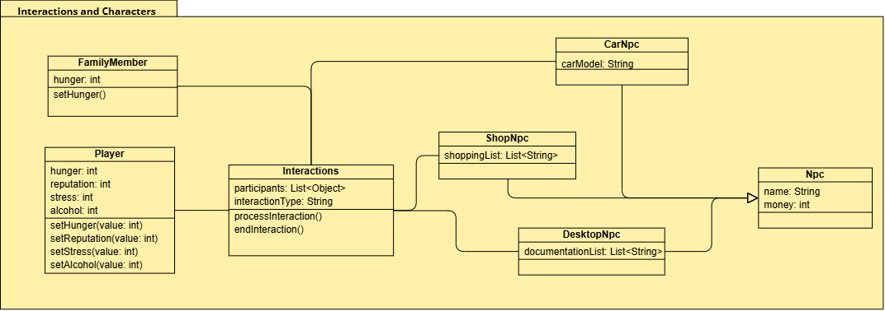
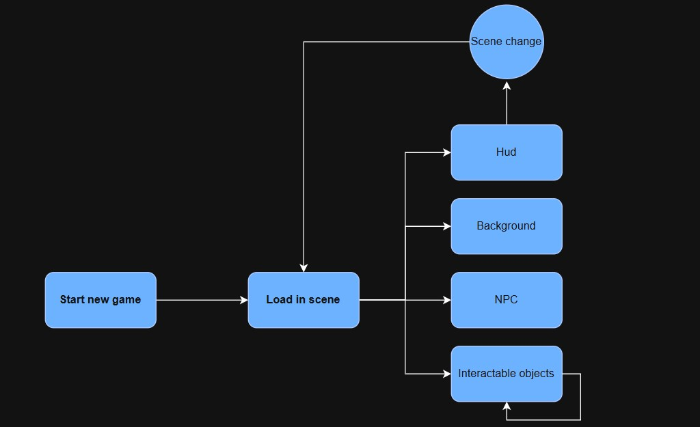
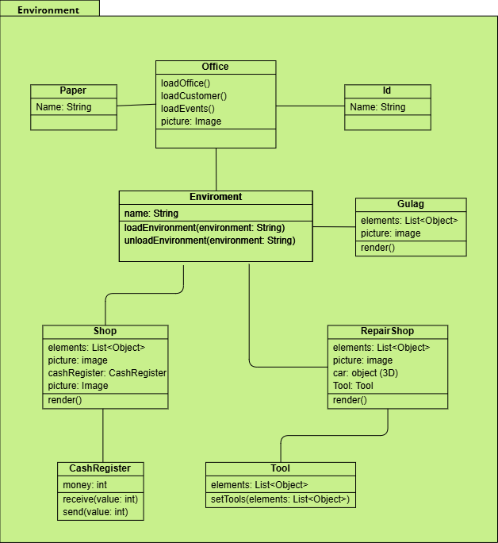
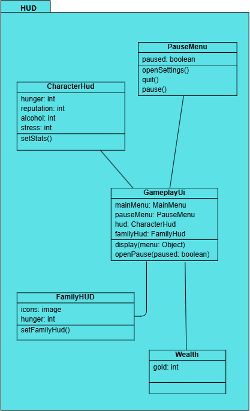

# Analízis Modell

## Bevezetés

A „Túlélés a Szocializmusban” című játékterv egy narratív-
központú, morális döntésekre és túlélési stratégiákra építő szimuláció, amely
egy fiktív szocialista ország gazdasági összeomlásának időszakában játszódik. A
játék középpontjában Piotr, a családfő áll, aki napról napra küzd meg a
rendszerszintű hiány, a társadalmi nyomás és a személyes morális dilemmák között,
miközben próbálja életben tartani a családját.

Az analízis modell célja a probléma tér struktúrájának feltárása: azaz azoknak a
fogalmaknak, entitásoknak és viszonyoknak az azonosítása, amelyek a játék
világának alapvető összetevői. Ennek megfelelően a következő szakaszban egy
kezdeti osztálydiagram készül, amely a játék világának fő komponenseit, azok
tulajdonságait és kapcsolatait mutatja be.

## Kezdeti osztálydiagram

Játékos

- A játék fő karaktere, akinek tulajdonságai közé tartozik az éhségszint,
  stressz, alkoholállapot, reputáció és munkabeosztás. A játékos állapotai
  befolyásolják a túlélést és a döntéseket.

Családtag

- A családtagoknak kizárólag éhségszintjük van, ami meghatározza életminőségüket
  és túlélési esélyeiket.

Munkahely

- Különböző típusú munkahelyek (pl. autószerelő, bolt, iroda), amelyekhez a
  játékos tartozhat és amelyek meghatározzák a napi tevékenységeket és jövedelmet.

Műszak

- A nap egy adott időszaka, amelyhez a munkavégzés vagy egyéb tevékenység
  kapcsolódik.

Tárgy

- A játékban használható, gyűjthető vagy kereskedhető eszközök és árucikkek.

Esemény

- A játék során bekövetkező döntési helyzetek, amelyek változást hoznak a
  történetben vagy a karakter állapotában.

MorálisDöntés

- Olyan választási lehetőségek, amelyek többféle következménnyel járhatnak és
  alakítják a történet menetét.

FeketepiacKapcsolat

- A nem hivatalos árubeszerzési és kereskedelmi lehetőségek rendszere.

NapiNapló

- Az egyes napok eseményeit, kiadásait és a család állapotát összefoglaló napló.

JátékÁllapot

- Globális mutatók, például reputáció, idő előrehaladása és túlélési esélyek,
  amelyek a játék egészére hatnak.

### Osztálydiagram

### Osztályok Felsorolása

MainMenu

- Az Main menu osztály a játék főmenüjét kezeli, ahol a játékos elindíthat új
  játékot, folytathat egy mentést, vagy módosíthatja a beállításokat. Tartalmazza
  a menüpontok listáját és a kiválasztott elemet. Metódusai felelősek a menü
  megjelenítéséért, a navigációért és a választás feldolgozásáért.

NewGame

- A New game osztály az új játék elindításáért felel, új játékállapotot hoz létre
  az alapértelmezett beállításokkal. Attribútumaiban tárolja az induló
  karaktereket, helyszíneket és kezdeti játékparamétereket. Metódusai az új játék
  inicializálását és a játékos számára elérhető első lépések beállítását végzik.

Continue

- A Continue osztály lehetővé teszi a korábbi játékállapot betöltését.
  Attribútumai a mentett állományok listája és a kiválasztott mentés. Metódusai a
  mentett állapot beolvasását és a játék folytatását biztosítják a kiválasztott
  ponttól.

Settings

- A Settings osztály a játék beállításainak kezelését látja el, beleértve az
  irányítást, hang- és képi beállításokat. Attribútumaiban tárolja az egyes opciók
  értékeit, mint a vezérlés, audio és video paraméterek. Metódusai az egyes
  beállítások módosításáért, mentéséért és visszaállításáért felelnek.

Controls

- A Controls osztály az irányítás testreszabásáért felelős. Attribútumai a
  billentyűkiosztás vagy kontroller gombok hozzárendelései lehetnek. Metódusai a
  bemeneti eszközök lekérdezését és az egyéni konfigurációk alkalmazását végzik.

Audio

- Az Audio osztály kezeli a hangbeállításokat, például a hangerőszinteket,
  hangszínszabályzókat, illetve az effekteket. Attribútumai a különféle
  hangerőértékeket és beállításokat tárolják. Metódusai a hang lejátszásáért,
  módosításáért és elnémításáért felelősek.

Video

- A Video osztály a megjelenítés beállításait kezeli, mint például a felbontás,
  grafikai minőség, képernyő mód. Attribútumai tárolják a jelenlegi grafikai
  konfigurációt. Metódusai az opciók módosítását és a változtatások alkalmazását
  végzik.

Interactions

- Az Interactions osztály a játékos és a világ közötti interakciókat kezeli,
  például NPC-kkel vagy tárgyakkal való kölcsönhatásokat. Attribútumaiban az
  aktuális interakció állapota és a résztvevő entitások szerepelnek. Metódusai az
  interakciók indításáért, folytatásáért és lezárásáért felelnek.

FamilyMember

- A Family members osztály a játékbeli családtagokat reprezentálja. Attribútumai
  tartalmazzák a családtagok nevét, szerepét és kapcsolatait a játékos
  karakterrel. Metódusai a családi események kezeléséért és a tagok állapotának
  frissítéséért felelősek.

Player

- A Player osztály a játékos karakterét reprezentálja, tartalmazva az állapotokat
  (például egészség, pozíció) és az inventárt. Attribútumai tárolják a karakter
  tulajdonságait és aktuális helyzetét. Metódusai az irányítást, mozgást,
  interakciókat és a karakter speciális képességeit kezelik.

CarNpc

- A Car NPC egy autóval rendelkező nem-játékos karakter, amely az autós
  közlekedést vagy egyéb, autóval kapcsolatos viselkedést modellez. Attribútumaiban
  szerepelhet az autó típusa, sebessége és helyzete. Metódusai a mozgás, navigáció
  és a játékossal való interakciók kezelését végzik.

ShopNpc

- A Shop NPC a boltos karaktert reprezentálja, aki árusít vagy vásárol a játékban.
  Attribútumai között szerepel az árukészlet és árak. Metódusai kezelik a
  kereskedelmi tranzakciókat, az áruk kínálatát és az árak módosítását.

DesktopNpc

- A Desktop NPC olyan nem-játékos karakter, aki asztalnál dolgozik vagy a
  számítógépnél van. Attribútumai tartalmazhatják az aktuális tevékenységet és az
  interakciós lehetőségeket. Metódusai információszolgáltatást vagy feladatok
  kiosztását végezhetik.

Office

- Az Office osztály egy irodai helyszínt modellez, ahol különböző tevékenységek
  zajlanak. Attribútumai lehetnek a bútorok, felszerelések és az ott dolgozó
  karakterek. Metódusai kezelik az iroda használatát és az eseményeket, amelyek
  ott történnek.

Id

- Az IDs osztály azonosító kártyákat vagy dokumentumokat képvisel, melyek
  hozzáférést vagy személyazonosságot igazolnak. Attribútumai tartalmazzák az
  azonosító adatokat. Metódusai az azonosítás és hozzáférés ellenőrzését végzik.

Paper

- A Papers osztály különféle dokumentumokat vagy papírokat foglal magában.
  Attribútumai a papírok tartalmát és státuszát tartalmazzák. Metódusai az olvasás,
  kezelés és eseményekhez kötött használatuk kezelését végzik.

Shop

- A Shop osztály egy bolt helyszínét reprezentálja, ahol kereskedelem zajlik.
  Attribútumaiban tárolja a készletet, az árakat és a vásárlókat. Metódusai a
  termékek kezelését, vásárlást és eladást biztosítják.

CashRegister

- A Cash register osztály a pénztárgépet képviseli, amely a fizetések
  lebonyolítását végzi. Attribútuma a tárolt pénzösszeg és a tranzakciók listája.
  Metódusai a fizetések rögzítéséért és az összeg kezeléséért felelősek.

RepairShop

- A Repair shop egy javítóműhelyt modellez, ahol tárgyak vagy eszközök javítása
  zajlik. Attribútumai között szerepelnek a szerszámok, javítandó tárgyak és a
  munkafolyamat állapota. Metódusai a javítási folyamatok indítását, nyomon
  követését és befejezését végzik.

Tool

- A Tools osztály a játékban található eszközöket képviseli, melyek különféle
  feladatokra használhatók. Attribútumaik lehetnek az eszköz típusa, állapota és
  használati ideje. Metódusaik az eszközök használatát és karbantartását kezelik.

Gulag

- A Gulag egy fogolytábort reprezentál a játékban, ahol foglyokat tartanak
  fogva és események zajlanak. Attribútumaiban a foglyok, őrök és biztonsági
  elemek szerepelnek. Metódusai a fogvatartás, események és menekülési lehetőségek
  kezelését végzik.

CharacterHud

- A CharacterHUD a játékos karakterének állapotát jeleníti meg a képernyőn,
  például élet- és energiaértékeket. Attribútumai az aktuális állapotadatokat
  tartalmazzák. Metódusai az állapot frissítését és megjelenítését végzik valós
  időben.

PauseMenu

- A Pause menus osztály a játék szüneteltetési menüit kezeli, amelyek megállítják
  a játékot és különböző opciókat kínálnak. Attribútumai a menüpontokat és azok
  állapotát tartalmazzák. Metódusai a menü megjelenítéséért, navigációjáért és
  bezárásáért felelnek.

FamilyHud

- A FamilyHUD a családtagok állapotának kijelzését végzi, segítve a játékost a
  családi kapcsolatok nyomon követésében. Attribútumaiban a családtagok állapotai
  és információi tárolódnak. Metódusai az adatok frissítését és megjelenítését
  végzik.

Wealth

- A Wealth osztály a játékos vagy család anyagi helyzetét kezeli és jeleníti meg.
  Attribútuma a pénzösszeg és esetleges vagyoni elemek. Metódusai a gazdasági
  változások nyomon követését és frissítését biztosítják.

### Alrendszerek

#### Menürendszer (UI menük)

Ez az alrendszer kezeli a játék fő- és beállítási menüit, a szünet menüt és a
beállításokat.

- MainMenu
- NewGame
- Continue
- Settings
- Controls
- Audio
- Video

#### Interakciók és Karakterek

Ebben az alrendszerben vannak a játékos és NPC-k, valamint az egymással való
interakciók.

- Interactions
- FamilyMember
- Player
- CarNpc
- ShopNpc
- DesktopNpc

#### Környezet

Ez az alrendszer az egyes helyszíneket és környezeti elemeket kezeli.

- Office
    - Id
    - Paper
- Shop
    - CashRegister
- Repair shop
    - Tool
- Gulag

#### Játékfelület (HUD)

Ez az alrendszer a játékos és család állapotának, vagyoni helyzetének
kijelzéséért felel.

- GameplayUi
- PauseMenu
- CharacterHUD
- FamilyHUD
- Wealth

## Menü alrendszer (UI menük)

### Statikus modell

Az alrendszer főbb osztályai a játék főmenü, új játék indítása, folytatás,
beállítások, irányítás, hang- és videóbeállítások, valamint a szüneteltetési
menük. Ezek az osztályok a játék indításának, konfigurálásának és
szüneteltetésének kezeléséért felelősek.

#### Kapcsolatok pontosítása

- A Main menu kapcsolódik a NewGame, Continue és Settings osztályokhoz,
  mivel innen indíthatók ezek a funkciók.
- A Settings kapcsolódik a Controls, Audio és Video osztályokhoz, mint alfunkciók.
- A Pause menus kapcsolatban állhat a Main menu-vel, mivel mindkettő menüket
  jelenít meg, de eltérő játékállapotokhoz.
- Az egyes menük között navigációs kapcsolatok figyelhetők meg, melyek a
  felhasználói választásokhoz kötődnek.

#### Attribútumok azonosítása

- **MainMenu**:

    - menuItems: List<String> — a menüpontok listája
    - selectedItem: String — aktuálisan kiválasztott menüpont
    - show()
    - hide()
    - navigateUp()
    - navigateDown()
    - selectItem()
    - Leírás: A játék főmenüjét kezeli, ahol a játékos választhat a fő opciók közül.

- **Newgame**:

    - initialCharacters: List<Player> — induló karakterek
    - initialSettings: Settings — alapértelmezett játékbeállítások
    - startGame()
    - setInitialCharacters(chars: List<Player>)
    - setInitialSettings(settings: Settings)
    - Leírás: Új játék indítását végzi az alapkarakterek és kezdőbeállítások alapján.

- **Continue**:

    - saveFiles: List<SaveFile> — elérhető mentések
    - selectedSave: SaveFile — kiválasztott mentés
    - loadGame()
    - showSaveList()
    - selectSave(save: SaveFile)
    - Leírás: Korábban elmentett játékállások listázását és betöltését végzi.

- **Settings**:

    - controlSettings: Controls
    - audioSettings: Audio
    - videoSettings: Video
    - openSettings()
    - saveSettings()
    - resetSettings()
    - Leírás: A játék vezérlési, hang- és grafikai beállításait kezeli.

- **Controls**:

    - keyBindings: Map<String, String> — billentyűkiosztás
    - setKeyBinding(action: String, key: String)
    - resetKeyBindings()
    - Leírás: A játék vezérlőgombjainak kiosztását kezeli.

- **Audio**:

    - volumeLevel: int
    - mute: bool
    - setVolumeLevel(value: int)
    - toggleMute()
    - Leírás: A játék hangerejét és némítási beállításait kezeli.

- **Video**:
    - resolution: String
    - graphicsQuality: String
    - setResolution(res: String)
    - setGraphicsQuality(level: String)
    - Leírás: A játék grafikai beállításait, például felbontást és minőséget kezeli.

### Dinamikus modell

(A dinamikus modell az alrendszer működésének időbeli folyamatát írja le,
például menük közti váltás, események kezelése.)

### Analízis modell osztálydiagramja

(A diagram megjeleníti a menürendszer osztályait és kapcsolatait,
lásd korábbi diagram.)

## Interakciók és Karakterek alrendszer

### Statikus modell

Ez az alrendszer kezeli a játékos, a különféle NPC-k (boltos, autós, asztali),
valamint a családtagok közötti interakciókat. Felel a karakterek
alapviselkedéséért és a kommunikációs lehetőségekért.

#### Kapcsolatok pontosítása

- A `Player` osztály kapcsolatban van minden `Npc`-vel (`CarNpc`, `ShopNpc`,
  `DesktopNpc`), mivel ezekkel léphet interakcióba.
- A `FamilyMember` kapcsolatban van a `Player`-rel, mivel az ő állapotuk
  (pl. éhségszint) a játékos tevékenységétől függ.
- Az `Interactions` osztály összeköti a `Player`-t a többi karakterrel, és
  kezeli az interakciós eseményeket.
- Az összes NPC örökölhet egy közös `Npc` alaposztályból (általános
  tulajdonságok és metódusok).

#### Attribútumok azonosítása

- **FamilyMember**:
    - hunger: int
    - setHunger()
    - Leírás: Egy családtagot reprezentál, akinek az éhségszintjét lehet beállítani.

- **Player**:
    - hunger: int
    - reputation: int
    - stress: int
    - alcohol: int
    - setHunger(value: int)
    - setReputation(value: int)
    - setStress(value: int)
    - setAlcohol(value: int)
    - Leírás: A játékos karaktert képviseli, különböző állapotértékekkel, melyeket be lehet állítani.

- **Interactions**:
    - participants: List
    - interactionType: String
    - processInteraction()
    - endInteraction()
    - Leírás: A játékbeli interakciókat kezeli két vagy több résztvevő között.

- **Npc**:
    - name: String
    - money: int
    - Leírás: Általános nem-játékos karakter, amelyből különböző NPC típusok származnak.

- **CarNpc (Npc-ből származik)**:
    - carModel: String
    - Leírás: Járművet használó NPC, amely egy adott autómodellel rendelkezik.

- **ShopNpc (Npc-ből származik)**:
    - shoppingList: List<String>
    - Leírás: Vásárlási listával rendelkező NPC, tipikusan bolti eladó vagy vásárló.

- **DesktopNpc (Npc-ből származik)**:
    - documentationList: List<String>
    - Leírás: Dokumentumokat kezelő NPC, tipikusan asztali számítógépes munkát végez.

### Dinamikus modell

(A dinamikus modell az interakciók időbeli működését írja le, például egy
beszélgetés elindítása vagy tranzakció végrehajtása.)

### Analízis modell osztálydiagramja

(A diagram ábrázolja a karaktereket, interakciókat, és azok kapcsolatait.)

## Környezet alrendszer

### Statikus modell

Ez az alrendszer kezeli a játék különböző statikus és interaktív helyszíneit,
mint az iroda, bolt, szerszámosműhely, kassza, iratok, azonosítók, illetve
a Gulag. Ezek fontos környezeti elemek, amelyekkel a játékos közvetlenül vagy
közvetetten kapcsolatba léphet.

#### Kapcsolatok pontosítása

- Az `Office` tartalmazhat `Desk` objektumokat, rajtuk pedig lehetnek `Paper`
  és `Id`.
- A `Player` kapcsolatban van a `Shop`, `CashRegister`, `RepairShop` és az
  `Office` helyszínekkel interakció céljából.
- A `Tool` a `RepairShop` részei, melyeket a játékos használhat.
- A `Gulag` helyszín különálló, narratív vagy következményalapú szerepet tölt be.

#### Attribútumok azonosítása

- **Environment**:
    - name: String
    - elements: List
    - picture: Image
    - loadEnvironment(environment: String)
    - unloadEnvironment(environment: String)
    - render()
    - Leírás: A játék világának adott környezetét reprezentálja, betölthető és kirajzolható objektumokkal.

- **Office (Environment-ből származik)**:
    - picture: Image
    - loadOffice()
    - loadCustomer()
    - loadEvents()
    - Leírás: Iroda környezet, ahol ügyfelekkel és eseményekkel lehet interakcióba lépni.

- **Paper**:
    - name: String
    - Leírás: Papíralapú dokumentum, amelyet az Office-ban lehet kezelni.

- **Id**:
    - name: String
    - Leírás: Személyazonosító dokumentum, például igazolvány.

- **Gulag (Environment-ből származik)**:
    - elements: List
    - picture: Image
    - render()
    - Leírás: Büntetőtábor környezet, speciális tárgyakkal és objektumokkal.

- **Shop (Environment-ből származik)**:
    - elements: List
    - picture: Image
    - cashRegister: CashRegister
    - render()
    - Leírás: Bolt környezet, ahol eladások és vásárlások zajlanak.

- **RepairShop**:
    - elements: List
    - picture: Image
    - car: Object (3D)
    - tool: Tool
    - render()
    - Leírás: Javítóműhely környezet, járművekkel és szerszámokkal.

- **CashRegister**:
    - money: int
    - receive(value: int)
    - send(value: int)
    - Leírás: Pénztárgép, amely képes pénzt fogadni és kiadni.

- **Tool:**

    - elements: List
    - setTools(elements: List)
    - Leírás: Szerszámgyűjtemény, amely beállítható és használható.

### Dinamikus modell

(A környezeti interakciók időbeli kezelése, például dokumentumok olvasása, bolt
használata vagy javítási folyamatok elindítása.)

### Analízis modell osztálydiagramja

(A diagram bemutatja a környezeti objektumok osztályait és azok összefüggéseit.)

## Játékfelület alrendszer (Gameplay UI, HUD)

### Statikus modell

Ez az alrendszer tartalmazza a felhasználó által látott interfészeket, mint
például a karakter állapotát mutató HUD, a családtagok állapotát jelző
Family HUD, valamint a szünetmenük és a játékos vagyoni helyzetét mutató elemek.

#### Kapcsolatok pontosítása

- A `CharacterHUD` kapcsolódik a `Player` osztályhoz, hogy valós időben
  jelenítse meg az állapotát (pl. energia, pénz).
- A `FamilyHUD` kapcsolódik a `Family member` osztályokhoz, hogy megjelenítse
  az éhségszintet.
- A `Pause menus` használható a `CharacterHUD`-on keresztül, mikor a játék
  szünetel.
- A `Wealth` megjelenítése szintén a `Player`-től függ.

#### Attribútumok azonosítása

- **GameplayUi**:
    - mainMenu: MainMenu
    - pauseMenu: PauseMenu
    - hud: CharacterHud
    - familyHud: FamilyHud
    - display(menu: Object)
    - openPause(paused: boolean)
    - Leírás: A játék közbeni kezelőfelület fő modulja, amely más HUD elemeket és menüket kezel.

- **CharacterHud**:
    - hunger: int
    - reputation: int
    - alcohol: int
    - stress: int
    - setStats()
    - Leírás: A játékos karakter állapotát mutató felület.

- **FamilyHud**:
    - icons: image
    - hunger: int
    - setFamilyHud()
    - Leírás: A családtagok állapotát mutató felület, például éhségszint.

- **PauseMenu**:
    - paused: boolean
    - openSettings()
    - quit()
    - pause()
    - Leírás: A játék szüneteltetésére szolgáló menü, ahol beállításokat is lehet nyitni.

- **Wealth**:
    - gold: int
    - Leírás: A játékos aranyát/pénzét nyilvántartó rendszer.

### Dinamikus modell

(Az állapotjelzők frissülnek a játék során a karakter változásainak megfelelően.)

### Analízis modell osztálydiagramja

(A diagram bemutatja a HUD elemek és a játékos/család közötti adatkapcsolatokat)

