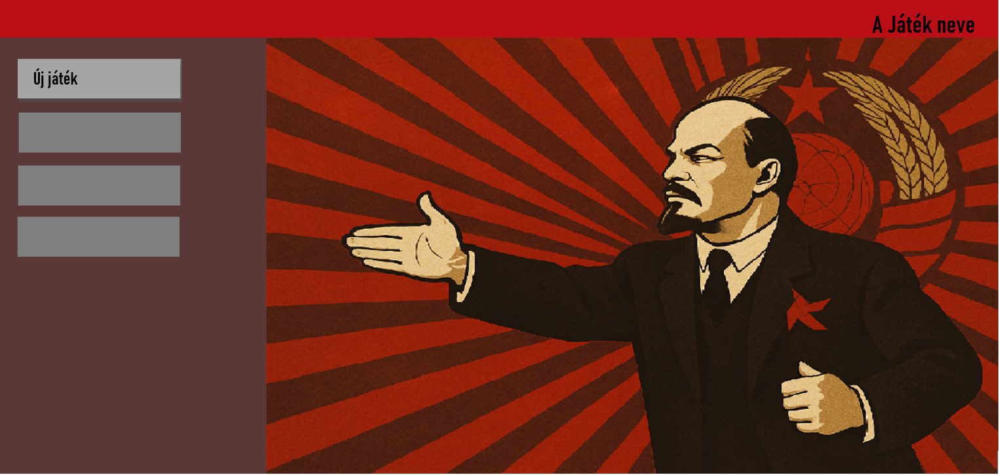
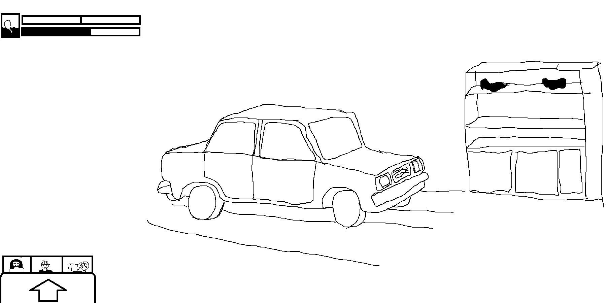
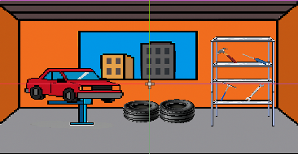
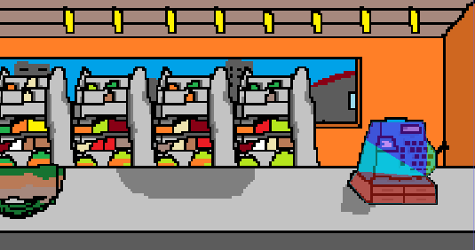
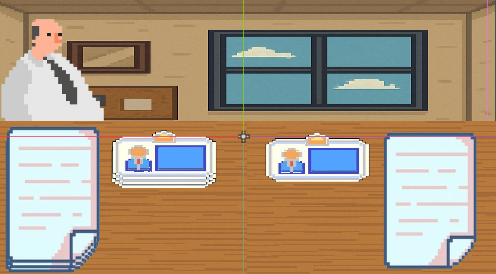
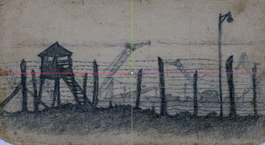

# Software Requirements Specification

## Bevezetés

Ez a dokumentum a "Túlélés a Szocializmusban" című játék szoftverkövetelményeit
írja le. A projekt célja egy olyan történetközpontú túlélőjáték megvalósítása,
amely valósághűen ábrázolja a szocialista korszak mindennapi kihívásait,
morális dilemmáit és túlélési stratégiáit.

A dokumentum elsődleges célja, hogy meghatározza a játék működésével,
megjelenésével, használhatóságával és technikai jellemzőivel kapcsolatos
követelményeket. A specifikáció támpontot ad a fejlesztéshez, teszteléshez,
valamint későbbi karbantartáshoz és bővítéshez.

## Áttekintés

A játékban a játékos egy átlagos állampolgár szerepébe bújik a szocializmus
idején. A cél a túlélés biztosítása különféle munkalehetőségek, véletlenszerű
események, és a családtagokról való gondoskodás közepette. A rendszer követi a
klasszikus túlélőmechanikák alapjait, de hangsúlyt helyez a morális döntésekre,
a hosszú távú következményekre és a történetmesélésre.

A játék Godot játékmotorral készül, nyílt forráskódú eszközökkel és saját
fejlesztésű vagy szabadon felhasználható tartalmakkal. Az SRS dokumentum a
követelmények részletes bontását tartalmazza a funkcionalitás, használhatóság,
teljesítmény és egyéb szempontok szerint.

## A Rendszer Funkciói

### Napi Ciklus (Main Loop)

A játék eseményei napokra bontott ciklusban zajlanak, amely a játékmenet
szerkezetének gerincét adja. Minden nap során különböző tevékenységek történnek,
ideértve munkavégzést, erőforrások beosztását, és a történet előrehaladását
befolyásoló döntéseket. A napi ciklus struktúrája adja a játék ritmusát, és
lehetőséget biztosít arra, hogy a játékos megtapasztalja a szocialista korszak
mindennapi kihívásait.

A napi események részletes működését a [Játékmechanika](#jatekmechanika)
szekció ismerteti.

### Autószerelő Minijáték

A játékos a történet során lehetőséget kap arra, hogy járműszerelőként
dolgozzon. A feladat célja különböző típusú gépjárművek meghibásodásainak
azonosítása és javítása. A játékos szabadon dönthet arról, melyik járművet
vállalja el, azonban nincs külső ellenőrzés a munkavégzés során.

Amennyiben a kijelölt javítási határidő (jellemzően néhány játéknap) lejár, és
a munka nem készül el, az ügyfél visszaveszi a járművét, és a játékos nem kap
fizetést. A játékos dönthet úgy is, hogy önként adja vissza a járművet, ha nem
tudja azt megjavítani, ekkor sincs pénzjutalom.

Előfordulhat, hogy bizonyos szerszámok kezdetben nem állnak rendelkezésre, így
egyes javítások nem hajthatók végre. Hibás (szándékos vagy véletlen) leadás
esetén nem garantált az azonnali visszajelzés: az ügyfél vagy észreveszi a
hibát, vagy nem. Amennyiben igen, a játékosnak vissza kell fizetnie a
munkadíjat, és jelentést is tehetnek róla a szocialista hatóságoknak.

Tartósan gyenge teljesítmény vagy súlyos hibák (pl. balesethez vezető hibás
javítás) akár az állás elvesztéséhez vagy a történet szerint munkatáborba
("gulágra") való küldéshez is vezethetnek.

Erről részletesebben a [Játéktörténet](#jatektortenet) és a
[Játékmechanika](#jatekmechanika) szekciókban olvashatunk.

### Bolt Minijáték

A bolt minijátékban a játékos bolti eladó szerepét tölti be. A játékmenet során
különböző vevők érkeznek, akiket ki kell szolgálni meghatározott időkereteken
belül. A pénztárgép manuális működésű, az árakat a játékosnak kell fejben
kiszámolnia vagy a bolt kézikönyve alapján meghatároznia.

A termékek között találhatók darabra, illetve súlyra értékesítettek. Az árakat
össze kell adni, illetve többszörözni, ha az adott termékből többet vesznek. A
játékmenet előrehaladtával a kiszolgálás egyre összetettebbé és gyorsabbá
válik, ezzel is növelve a kihívást.

A játékos saját pénzéből vásárolhat egyszerű számológépet, amely segítséget
nyújt a számításokhoz. Ez a funkció elsősorban azoknak szól, akik a játékot
"vanilla" (külső eszköz nélküli) formában kívánják játszani.

Erről részletesebben a [Játéktörténet](#jatektortenet) és a
[Játékmechanika](#jatekmechanika) szekciókban olvashatunk.

### Beállítási Rendszer

A felhasználók a különböző beállításokat módosíthatják közvetlenül a játék
menüjéből, illetve manuálisan a `settings.ini` fájl szerkesztésével. A menüben
végrehajtott módosítások mindig felülírják a `settings.ini` tartalmát
mentéskor. A beállítások mentése **atomikusan** történik, így egy esetleges
összeomlás esetén (a fájlrendszer sérülését nem számítva) a fájl mindig vagy a
korábbi, vagy a legutolsó érvényes állapotban marad. Sosem kerül félkész vagy
sérült állapotba.

Ha a `settings.ini` fájl nem létezik, a rendszer automatikusan létrehozza azt
alapértelmezett beállításokkal.

Az alábbi értékek adhatók meg a beállítási fájlban:

| Név                | Típus                   | Leírás                             | Default  |
| ------------------ | ----------------------- | ---------------------------------- | -------- |
| `[volume]`         |                         | Hangerő szabályok                  |          |
| `master`           | int [0, 100]            | Master hangerő                     | `40`     |
| `effect`           | int [0, 100]            | Effektusok hangereje               | `100`    |
| `music`            | int [0, 100]            | Háttérzene hangereje               | `100`    |
| `ui`               | int [0, 100]            | UI-ban való cselekvések hangereje  | `100`    |
| `[video]`          |                         | Grafikával kapcsolatos beállítások |          |
| `quality`          | `low`, `medium`, `high` | Grafika minőség                    | `medium` |
| `animations`       | bool                    | UI animációk                       | `yes`    |
| `font`             | `pixel`, `readable`     | Betűtípus                          | `pixel`  |
| `[main]`           |                         | Egyébb                             |          |
| `lang`             | string                  | Játék nyelve                       | `ask`    |
| `content-warn-ack` | bool                    | Tartalom figyelmeztetés elfogadva  | `no`     |

A `content-warn-ack` beállítás különleges szerepet tölt be: ennek elfogadása
kötelező a játék elindításához. Amennyiben nincs elfogadva (alapértelmezetten
`no`), a játék indításakor megjelenik egy tartalomra vonatkozó figyelmeztetés,
amelyet a játékosnak el kell fogadnia a folytatáshoz. Elfogadás után ez a
figyelmeztetés a továbbiakban már nem jelenik meg.

Ha egy beállítás hiányzik a fájlból, akkor automatikusan az alapértelmezett
érték kerül alkalmazásra.

A beállítások grafikus változatáról az [Interfészek](#interfeszek)
szekcióban olvashatunk.

### Mentési Rendszer

A játék "végtelen" (ameddig a tárhely engedi) mentés létrehozására ad
lehetőséget. A mentések a `saves` jegyzékbe kerülnek. A mentési file neve
megegyezik a mentés nevével, kivéve hogy a whitespace karakterek `-` karakterre
lesznek cserélve, és a `.save` a végéhez lesz fűzve.

A mentések a fentebb írt módon **atomikusan** történnek. Illetve automatikusak
is.

## Használhatóság (Usability)

- A játék kezelése intuitív, különösen azok számára, akik korábban játszottak
  már point-and-click stílusú játékokkal.

- **Gyengénlátók támogatása:** A `readable` betűtípus-választás lehetőséget
  nyújt azoknak a játékosoknak, akik számára a pixeles megjelenítés nehezen
  olvasható.

- **Színvakok támogatása:** A játékban a színalapú jelzéseket kiegészítő elemek
  is segítik az értelmezést (pl. ikonok, szimbólumok), így minden információ
  többcsatornásan is elérhető.

- **"Potato PC" kompatibilitás:** A játék alacsony rendszerkövetelményeinek
  köszönhetően régebbi vagy gyengébb teljesítményű gépeken is megfelelően fut.

- **Multiplatform támogatás:** A játék natívan elérhető Linux és Windows
  rendszerekre. macOS-re való portolása is könnyen megvalósítható, azonban a
  fejlesztői csapatban jelenleg nincs Apple géppel rendelkező tag.

- **Érzékeny tartalomra való figyelmeztetés:** A játék egyes elemei érzelmileg
  megterhelők lehetnek azok számára, akik személyesen vagy közvetetten
  érintettek voltak a szocialista rendszerben. A játék ezért a kezdés előtt
  figyelmeztetést jelenít meg, amelyet a játékosnak el kell fogadnia.

## Megbízhatóság (Reliability)

A **"Túlélés a Szocializmusban"** célja, hogy stabil és megbízható játékélményt nyújtson minden felhasználói környezetben. A játék rendszeres mentési pontokat alkalmaz, így az esetleges hibák vagy megszakítások nem vezetnek adatvesztéshez. A hibaállóságot úgy terveztük, hogy a kritikus funkciók (pl. játékállás mentése, döntéslogika, erőforrás-kezelés) minden körülmények között konzisztensen működjenek.

A tesztelés során kiemelt figyelmet kapnak:

- a váratlan események kezelése (pl. megszakított mentés, rendszerösszeomlás),
- a döntési útvonalak következetessége,
- a szkriptelt események stabilitása.

## Teljesítmény (Performance)

A játék célja, hogy széles körű hardverkonfigurációkon is zökkenőmentesen fusson, különösen mivel az oktatási vagy alacsonyabb erőforrású környezetek is potenciális célcsoportot jelentenek.

Fontos teljesítménykritériumok:

- Gyors betöltési idők (maximum néhány másodperc menük és jelenetek között)
- Stabil, legalább 30 FPS teljesítmény még gyengébb gépeken is
- Alacsony memóriahasználat: optimalizált assetek, háttérben futó folyamatok minimalizálása
- Támogatás 16:9 és 4:3 képarányokra, valamint különböző felbontásokra

## Támogatottság (Supportability)

A játék fejlesztése során szem előtt tartjuk a hosszú távú karbantarthatóságot és a könnyű hibajavítást.

Támogatottsági irányelvek:

- Moduláris kódbázis, amely megkönnyíti az új funkciók beépítését vagy hibák elszigetelt javítását
- Rendszeres frissítések: kisebb javítások és funkciófrissítések tervezett ütemezéssel
- Hibajelentési lehetőség: beépített funkció vagy külső platformon (pl. GitHub Issues vagy e-mailes forma)
- Dokumentált API-k és eseménykezelések a fejlesztők és modkészítők számára

## Tervezési Korlátozások (Design Constraints)

A játék tervezése során számos korlátozást kellett figyelembe venni, amelyek befolyásolták a végső megvalósítást:

- **Történelmi hűség**: A szocialista korszak bemutatása nem torzítható játékmechanikai célok miatt. Ez korlátozza a túlzottan stilizált vagy eltúlzott elemek használatát.
- **Etikai határok**: A morális dilemmák megjelenítése érzékeny téma, ezért minden narratív döntés és karakterábrázolás alapos kutatáson alapul.
- **Offline működés**: A játék teljes mértékben offline is játszható, így nem építhet kritikus funkciókat internetkapcsolatra.
- **Platformfüggetlenség (minimálisan)**: Az alapverzió PC-re készül, de a vezérlési logikát és UI-t úgy alakítottuk ki, hogy későbbi portolás (pl. mobil vagy konzol) se igényeljen jelentős újratervezést.
- **Erőforráskorlátok**: A fejlesztés során kis csapat dolgozik a játékon, így a technikai megvalósítások és tartalombővítések reálisan tervezettek.

## A Játék Súgórendszere

A játék különféle módokon nyújt segítséget a felhasználó számára, hogy teljes mértékben elsajátíthassa a különböző funkciókat.
Az első napon mindenre kiterjedő eszközökkel támogatjuk a játékos előrehaladását.
A játék funkcióit egyszerű és könnyen megjegyezhető módon implementáljuk.
A játék funkcióit és minijátékait a játékos dinamikusan ismeri meg, ami megkönnyíti azok megjegyzését.
A játékos nem kap egyszerre túl sok információt – a funkciókat fokozatosan ismeri meg.
Ez a fokozatosság hozzájárul a hatékonyabb tanuláshoz és a pozitív játékélményhez.

### Használt Eszközök

- **Szövegbuborék**
  A játék első napján megjelenő tájékoztató eszköz, amely lényegesebb és bővebb információk átadására szolgál. Ezt a segédeszközt a játékos bármikor kikapcsolhatja a beálításoknál.
  Magyarázó jelleggel, röviden leírja az adott funkció célját és működését.
  Az új funkciók megjelenésekor is felbukkannak.

- **Kiemelés**
  Vizuálisan kiemeli az éppen bemutatott grafikai elemeket (pl. gombokat, paneleket).
  Egyértelműen megmutatja, mire kattinthat a játékos vagy mit kell megfigyelnie.

- **Leírás**
  Rövid, állandó szöveges jelölések, amelyek a bonyolultabb funkciókat néhány szóban megnevezik.
  Ezek nem részletes magyarázatok, hanem gyors beazonosítást segítő címkék.
  Például egy gomb fölött megjelenő statikus címke.

## Felhasznált Kész Komponensek

A játék megalkotásakor törekszünk az egyediségre.

A projekt keretében nem használunk előre elkészített, külső kész komponenseket (pl. Godot pluginokat, Unity asseteket, külső API-kat). Minden funkció saját fejlesztésű modulokból épül fel.

Ugyanakkor a fejlesztés során különféle generatív mesterséges intelligencia eszközök támogatják a munkát, különösen a következő területeken:

- **Textúrák és vizuális elemek előállítása:**
  Alap textúrák és mintaelemek generálása AI-modellek (pl. DeepSeek, DALL·E) segítségével történik. Ezeket a tartalmakat a csapat tovább szerkeszti, hogy megfeleljenek a játékon belüli stílusnak és technikai követelményeknek.

- **Dokumentációs vázlatok és technikai szövegek előállítása:**
  A projekt dokumentációjának bizonyos részei (pl. struktúra, megfogalmazás) generatív nyelvi modellek (pl. ChatGPT) segítségével készültek, majd manuálisan átnézésre és szerkesztésre kerültek.

- **Kódötletek és algoritmiai javaslatok:**
  A játék bizonyos algoritmusainak (pl. alap mesterséges intelligencia logika, játékmenet prototípus) megtervezését nyelvi modellek (ChatGPT, DeepSeek Code) inspirálták, de minden végső megvalósítás saját fejlesztés.

Fontos megjegyezni, hogy minden AI által generált tartalom utólagos ellenőrzésen és testreszabáson megy keresztül, így a végső termék teljes mértékben megfelel a projekt minőségi és jogi elvárásainak.

## Interfészek

A játék stílusa szovjet propaganda szerű karikatúra. a navigálás a menüpontok illetve minden más részén a játéknak az egérrel valósul meg
A projekt során az alábbi interfészeket használjuk a különböző komponensek és rendszerek közötti együttműködés biztosítására:

### Felhasználói Interfész (UI)

- A játék felhasználói felülete Godot-ban kerül kialakításra, jellemzően `Control` típusú node-okkal.
- A UI tartalmazza: főmenü, beállítások menü, játék közbeni HUD (élet, stressz, stb.), játék végi képernyő.
- Felhasználóbarát elrendezés, egér- és billentyűzet/touch kompatibilitás.

#### Főmenü UI

Egyszerű minimalisztikus statikus hátérkép itt csak gombok találhatóak amik stílushoz megfelelően textúrázottak.
Főmenü gombjai:

- beállítások: beállítások menüpontra navigál
- új játék: elindítja az új játékot (az elejéről)
- játék folytatása: betölti az előző mentést

#### Beállítások UI

Átlátható, (egyszerű háttér) címkék alatt találhatók a megfelelő beállítások amik csúszkák illetve több opciós kiválasztható dobozok. A címkék közül egyszerre egy választható és csak annak a beállításai jelennek meg. A címkék legfelül mindig láthatóak.
Beállítások elemei:

- grafika (címke)
  - teljesképernyős ki/be
  - felbontás: 3840x2160 / 2560x1440 / 1920x1080 / 1600x900 / 1366x768 / 1280x720 / 1024x768 / 800x600
  - világosság 0-100%
- audió/nyelv (címke)
  - nyelv Magyar/English
  - főhangerő 0-100%
  - zene hangerő 0-100%
  - effekt hangerő 0-100%
- segítség ki/be : kikapcsolja a felbukkanó segítő leírásokat és kijelöléseket
- kész gomb: visszavisz az előzőleg használt oldalra

#### Játék UI

Álltalába statikus elemekből áll kevés részt takar ki a képernyőből.
Játék UI elemei:

- életerő csík
- éhségmérő csík
- józanságmérő csík
- beállítások ikon
  - mentés és kilépés főmenü/játék bezárása
  - beállítások
- óra: időt méri illetve az eltelt napokat
- család ikon: megnyitja a család felugró ablakot amin a családtagok vannak és az ő éhségmérőjük

### Grafikai Interfész

- A 3D modellek és animációk Blenderben készülnek, majd `.glb` (GLTF 2.0) formátumban kerülnek exportálásra Godot-ba.
- Az interfész itt az **asset export pipeline**: Blender → GLTF → Godot import rendszer.
- Anyagok, UV térképek, animációcsatornák kompatibilitása biztosított.

### Koncepciós Rajzok

Kezdőképernyő

Beállítások

Játék nézet

## Alkalmazott Szabványok

**Applicable Standards**

A játékfejlesztés és üzemeltetés során az alábbi szabványokat és előírásokat vesszük figyelembe. A szabványokat két kategóriában ismertetjük: kötelezően alkalmazandó (jogszabályi vagy technikai előírások), illetve választható, de a fejlesztők által követett szabványok.

### Kötelezően Alkalmazandó Szabványok

**Mandatory Standards**

- **Digitális hozzáférhetőségi irányelv (WAD - Web Accessibility Directive):**
  Amennyiben a játék tartalmaz webes felületet (pl. dokumentáció vagy beállítások online elérése), biztosítani kell a minimális akadálymentesítési előírások betartását.

- **Szerzői jogi előírások:**
  A felhasznált grafikai, zenei vagy egyéb médiatartalmak esetén be kell tartani az adott licenceket (pl. CC-BY, MIT, GNU GPL).

### Választás Alapján Alkalmazott Szabványok

**Optional Standards**

- **Godot Engine GDScript Style Guide:**
  A fejlesztés során követjük a Godot által ajánlott kódolási stílusirányelveket a jobb olvashatóság és karbantarthatóság érdekében (pl. elnevezési konvenciók, indentálás, dokumentálás).

- **Semantic Versioning (SemVer 2.0.0):**
  A projekt verziózására a szokásos `MAJOR.MINOR.PATCH` séma alkalmazása történik a GitHubon való egyértelmű kiadások érdekében.

- **Markdown dokumentációs szabványok:**
  A projekt dokumentációja `.md` formátumban készül, egységes szintaxis és struktúra szerint (pl. címhierarchia, kódrészletek formázása).

- **Open Design and Development Practices:**
  A fejlesztés nyílt forráskódú eszközökkel (Godot, Blender, GitHub) történik, az átláthatóság és közösségi bevonhatóság biztosítása céljából.

## Játéktörténet

### Cím: "Piotr naplója – Egy család a holnap küszöbén"

**Időpont:** 1988. december
**Helyszín:** Egy fiktív kelet-európai szocialista állam nagyvárosának külvárosi lakótelepe

### Alaptörténet

A történet főhőse **Piotr**, egy negyvenes éveiben járó családfő, aki feleségével, **Mihalinával**, és három gyermekével – **Gustav** (11), **Matka** (7) és **Vilen** (fél éves) – próbál túlélni a szocialista rendszer összeomlásának küszöbén.

A háztartás egy apró, penészes panellakásban tengődik a hónapról hónapra egyre súlyosabbá váló hiánygazdaságban. A fűtés akadozik, a kenyérjegy már csak lisztre elég, és a legfontosabb gyógyszerek is eltűntek a patikákból. A gyerekek betegeskednek, Mihalina egyre fáradtabb. Piotr vállán nyugszik minden: a jövő, a napi megélhetés, a döntések súlya – és a lelkiismeret.

### Munkák és a Mindennapok

Piotr többféle munkát is vállalhat – néha párhuzamosan is –, hogy biztosítsa a család túlélését. Mindegyik munkatípus másképp hat az életére:

### Autószerelő Műhely – "Féken tartott életek"

Egy állami tulajdonban lévő, lepusztult autószerelő műhelyben dolgozik, ahol keleti blokkos Zsigulik, Wartburgok és Trabantok sorakoznak javításra. Itt naponta **fizikai munkát végez**, hosszú órákon át szerel, gyakran feketén csempész be alkatrészeket vagy "megbütyköz" egy-egy javítást.

- A fizetés kiszámíthatatlan.
- Ha hibázik, **büntetést vonhat maga után**, de néha lopott alkatrészekből is lehet pénzt csinálni – ha nem bukik le.
- A brigádban gyakoriak a konfliktusok, de egyben a legnagyobb az "összetartás".

#### Játékmenet

- **2D-s tér**, amelyben **a kocsi 3D-ben, ortogonálisan jelenik meg**, a játékos **forgathatja a járművet**.
- A **hibák felderítéséhez műszereket kell használni**, majd szerszámokkal lehet javítani – mindkettő **időigényes folyamat**.
- A műszerek és szerszámok **a polcon találhatók**, egyszerre **csak egyet** lehet kézbe venni.
- **Ha a javítás nem készül el időben**, a fizetés jelentősen csökken.
- A precizitás és gyorsaság egyensúlya kulcsfontosságú.

### Bolti Eladó – "Polcok és pletykák"

Részmunkaidőben a helyi közértnél is besegít. Az állandó sorban állás miatt a vevők frusztráltak, az árukészlet nevetségesen szegényes, és minden második ügyfél **valami "külön" dolgot kér** – háttéralkuk, rejtett kérések, és gyakran **cserekereskedelem** jellemzi a boltot.

- A bolt lehetőséget kínál feketepiaci kapcsolatok kiépítésére.
- A reputáció itt kulcsfontosságú – ha Piotr lebukik csúszópénz elfogadásánál, az állását és a lakását is elveszítheti.
- Mihalina néha segít be adminisztratív munkában, de gyerekek mellett ez ritka.

#### Játékmenet

- **2D-s tér**, ahol a kamera **a pult mögül néz előre**.
- A vásárlók **balról jobbra** érkeznek a boltba.
- Vásárlók **elmondják mit kérnek**, a játékos a kézikönyv alapján **meghatározza az árakat** és **fejben kiszámolja** az összeget.
- Fizetés után:
  - **Megnyitjuk a pénztárgépet**, betesszük a pénzt.
  - A játék **automatikusan kiszámolja a visszajárót**, amit átadunk.
  - **Bezárjuk a kasszát**.
- **Hibás visszajáró**:
  - Ha **többet adunk**, a vevő nem szól, de **a nap végén levonás jár**, és **a reputáció is csökken**.
  - Ha **kevesebbet adunk**, a vevő reklamál – **súlyos reputációvesztés** jár.

### Irodai Munka – "Tollak és titkok" (Tervezett vagy Későbbi Szakasz)

Később lehetőség nyílik egy irodai munkára a pártbizottság egyik osztályán – statisztikai feldolgozás, aktatologatás, jelentések gépelése. A munka monoton, de stabil. Ugyanakkor **kompromittáló információk** is átfolynak Piotr kezei között: nevekről, lejelentésekről, megfigyelésekről.

- A fizetés jobb, a stressz más jellegű.
- A munkából származó adatokkal vissza is lehet élni – ha Piotr elad infókat, gyorsan sok pénzhez juthat, de nagy kockázattal.

#### Játékmenet

- **2D-s tér**, ahol **az asztalt és dokumentumokat** látjuk felülnézetből.
- A játékosnak **hibákat kell keresnie**:
  - **Szöveges dokumentumokban elgépelések**, hamis adatok.
  - **Személyi aktákban hibás betűk vagy dátumok**.
- Bizonyos dokumentumokat **ki lehet szivárogtatni**, ezért:
  - Jutalom (pénz, árucikk, információ).
  - **Ha lebukik**, súlyos reputációvesztés, akár teljes ellehetetlenülés.

### A Mindennapi Dráma

A munkahelyeken túl a történet mélyebb rétegeiben az igazi tét: **együtt marad-e a család**, és **megélik-e a rendszerváltást?** A történet során gyakran kerül sor morális döntésekre:

- Érdemes-e elcsenni egy olajszűrőt a műhelyből, ha abból tejpor vehető Vilennek?
- El lehet-e adni a boltból egy doboz szardíniát a feketepiacon, ha abból gyógyszert lehet venni Gustav lázára?
- Megéri-e "jelenteni" egy kollégát a pártirodán, ha abból előléptetés származik – vagy túl nagy a lelki ára?

A rendszer fojtogató, és **a játék lényege nem az, hogy hős legyen a játékos, hanem hogy ne törjön meg teljesen.**

### Narratív Csúcspontok és Zárások

A történet az év végére fokozatosan eljut a **rendszerváltás hajnaláig**: tüntetések kezdődnek, új pártok alakulnak, a vezetés meginog. A játékban ezek **háttérként** jelennek meg – a fő fókusz mindig a családon és a hétköznapi emberek döntésein van.

### Lehetséges Végkimenetelek

- **Túlélés együtt:**
  A család minden tagja megéri a rendszerváltást. A jövő bizonytalan, de szabadabb.

- **Széthullás:**
  Egy vagy több családtag elvész – éhség, betegség, börtön miatt.

- **Korrumpálódás:**
  A túlélés sikerül, de morálisan megkérdőjelezhető úton.

- **Piotr bukása:**
  Lebukik, Gulágra kerül – a játék új szintre vált, ahol már csak egy cél van: nem meghalni.

### Hangvétel és Stílus

A történet személyes, keserédes, realista. Tele van _belső monológokkal_, _családi párbeszédekkel_, _utalásokkal a korszakra_, és azzal a soha ki nem mondott kérdéssel:

> **"Megéri még becsületesnek lenni?"**

## Játékmechanika

### Alapmechanikák

A játék egy túlélés-orientált, napokra bontott szimuláció, amely során a játékos – **Piotr** – egy fiktív szocialista országban próbálja eltartani családját, miközben a rendszer gazdasági és erkölcsi nyomása alatt lavírozik.

A mechanikák célja, hogy folyamatos döntéskényszerbe helyezzék a játékost a következő területeken: **idő, erőforrás, morál, és kockázat**.

### Időkezelés és Napi Ciklus

- A játék **napokra** van bontva.
- Minden nap **reggeltől estig szabadon tervezhető**:
  - A játékos **időblokkokban** dönthet arról, hogy mikor melyik munkahelyen dolgozik, mikor intéz otthoni feladatokat, mikor pihen vagy cserekereskedik.
  - Egy nap több különböző tevékenységet is tartalmazhat (pl. délelőtt műhely, délután bolt, este csere).
- A nap végén következik az **összegzés és állapotfrissítés**:
  - Bevétel és kiadás összesítése
  - Éhség, stressz, alkoholszint, reputáció frissítése
  - Családtagok állapotának ellenőrzése
  - Események aktiválása (esély alapú vagy szkriptelt)

### Munkahelyi Interakciók

#### Autószerelő Műhely (3D Szegmens)

- Interaktív szerelési feladatok (alkatrészcsere, hibakeresés, javítás).
- Minden munkadarab több lépéses, hibázás vagy késés reputáció- és jövedelemvesztést okoz.
- Lehetőség van **alkatrészek eltulajdonítására** vagy "kamu megoldásra".
- Túl hosszú vagy sietős munka → stressz nőhet.

#### Bolti Eladó (2D Szegmens)

- Vásárlók kiszolgálása korlátozott kínálat mellett.
- Kezelni kell a csereigényeket, váratlan kéréseket, feketepiacot.
- Helytelen vagy elutasított interakció → bevétel-, reputáció- vagy hangulatsérülés.
- Illegális eladásokkal kockáztatni lehet – több pénz, de lebukási esély.

#### Irodai munka (Tervezés Alatt)

- Adminisztrációs jellegű feladatok, ismétlődő mini-játékok (adatbevitel, gépelés).
- Jutalom: stabil jövedelem, alacsony fizikai megterhelés.
- Döntések: információk eltussolása vagy továbbadása → extra haszon vagy veszély.

### Állapotmutatók (Statrendszer)

A játékosnak és családtagjainak túlélése több mutatótól függ:

- **Éhség** – Folyamatosan nő.
  - Ha **teljesen lemerül**, **Piotr vagy egy családtag meghal**.
  - Étkezésre időt és pénzt kell fordítani.
- **Stressz** – Növekszik munka, események vagy konfliktusok hatására.
  - Magas szinten mentális problémákhoz vagy rossz döntésekhez vezethet.
- **Alkoholfüggőség** – Alkohol csökkenti a stresszt, de rendszeres fogyasztás esetén kialakul a függőség.
  - Ez automatikus fogyasztást, reputációcsökkenést és munkaképesség-romlást okozhat.
- **Reputáció** – A játékos társadalmi megítélése.
  - Befolyásolja, ki bízik benne, milyen lehetőségei lesznek, mekkora a lebukás esélye.

**Családtagok** nem rendelkeznek saját mutatókkal, de az **éhségszintjük folyamatosan csökken**.
Ha nem jutnak megfelelő ellátáshoz, megbetegedhetnek vagy meghalhatnak.

### Erőforráskezelés és Szabad Döntések

A játékos minden nap:

- **szabadon osztja be idejét**: mikor, hol és mennyit dolgozik.
- **önállóan dönt** arról, mire költi a megszerzett pénzt:
  - Étel (saját és család számára kötelező)
  - Stresszoldók (pl. alkohol)
  - Illegális árucikkek (pl. gyógyszer, alkatrész)
  - Spórolás (kevésbé biztonságos)

A tervezés részét képezi a fizikai energia, pénz és morál egyensúlya.

### Cserekereskedelem és Hiánygazdaság

- Az állami boltok kínálata **szűkös**, gyakran kiszámíthatatlan.
- Cserekereskedelem zajlik ismerősök, árusok, "hátsó ajtós" karakterek révén.
- Ritka tárgyakhoz (pl. gyógyszer, gyerekruha, babatápszer) csak kapcsolatokon vagy feketepiacon keresztül lehet hozzájutni.
- A rendszer célja, hogy **bátorítsa a kockázatvállalást**, de magas áron.

### Események és Morális Dilemmák

Minden nap aktiválódhat egy vagy több **esemény**, amelyek szituációs döntések elé állítják a játékost:

- Munkahelyi: elhallgatni egy hibát, vagy feldobni egy kollégát
- Otthoni: családtagok kérései, krízisek
- Közösségi: párttag megfigyel, vagy valaki segítséget kér

Ezek a döntések azonnali vagy hosszútávú következményekkel járnak:

- Pozitív: plusz pénz, jó kapcsolat
- Negatív: lebukás, stressz, haláleset

### Kockázat és Következmény Rendszer

A játékban minden törvénytelen vagy etikailag szürke tett lebukással fenyeget.

- **Első lebukás**:

  - Piotr börtönbe kerül néhány napra.
  - Nem tud dolgozni → nincs bevétel.
  - A család éhezik.
  - Reputáció nagyot zuhan.

- **Második lebukás**:
  - Piotr a Gulágra kerül → ez egy alternatív játékszakasz.
  - Nincs visszaút, a cél innentől a puszta túlélés.
  - A család sorsa végérvényesen bizonytalanná válik.

### Végjáték és Értékelés

A játék 1988. decemberében indul, és **1989 nyaráig** tart.

A végkifejlet függ:

- Hány családtag él túl
- Piotr mentális és fizikai állapotától
- Reputáció és erkölcsi integritás szintjétől
- Mennyi pénz és kapcsolat maradt

Többféle befejezés lehetséges, az alábbi témák mentén:

- Megmenekülés és újrakezdés
- Családi tragédia
- Morális bukás vagy megmaradás
- Gulág-túlélés

### Összefoglalás

A játékmechanika célja, hogy a játékos **napról napra meghozza a nehéz döntéseket**:

- Hol dolgozzon, mikor pihenjen, mibe fektessen
- Kockáztasson-e a túlélésért vagy maradjon erkölcsös
- Hogyan lavírozzon a hiánygazdaság és a család túlélése között

> "A mindennapokban nem a hősiesség, hanem a jó döntés a legnagyobb fegyver."

## Játéklogika – Kiegészítések

Az alábbi pontosítások **felülírják / kiegészítik** a korábban leírt szabályokat.

### Alkohol–Éhség Szinergia

| Változó      | Jelölés           | Hatás                                      |
| ------------ | ----------------- | ------------------------------------------ |
| Alkoholszint | `alkohol` (0‑100) | 50 felett **negatív módosító** az ételekre |
| Éhség        | `ehseg` (0‑100)   | 0 = halál                                  |

#### Szabályok

- **Alkoholhatár (50) – "függőségi küszöb"**
  - Ha `alkohol` > 50, akkor az ételek **hatékonysága csökken**.
  - A csökkentés mértéke:
    $$
        \text{módosító} = \frac{\,\text{alkohol} - 50\,}{3}
    $$
    _Azaz 65‑ös alkoholnál a kaja 5 ponttal (15/3) kevesebbet tölt az éhségből._
- **Fokozódó kényszer**
  - Amint `alkohol` lecsökken **50‑re**, ott **"padlózik"**: magától nem megy 50 alá.
  - A küszöb ezután **egyre magasabbra tolódik**:
    - Először 60 → 70 → 80 → 90.
    - Ha a játékos nem tartja a _következő_ küszöböt, **stressz‑büntetést** kap, és az ételek még kevésbé hatnak (lásd lentebb).
- **Stressz‑büntetés és éhségszankció**
  - Ha az aktuális "kötelező" szint alá esik az alkohol:
    - `stressz` azonnal +15
    - Az ételek **hatékonysága feleződik** a normál értékhez képest, amíg vissza nem éri a küszöböt.

### Időciklus Finomítása

#### Napi Főidő: 08:00 – 20:00

- **3 fő blokk** (délelőtt, délután, kora este) = _produktív idő_.
- Tevékenységek (munka, csere, vásárlás) ezeken belül zajlanak.

#### Szabadidő: 20:00 – lefekvés

- Szabadon etetés, beszélgetés, olvasás, iszogatás.
- **Alváskezdés**: bármikor, de lásd alábbi szabályt.

#### Alvás–Stressz Kapcsolat

| Alvással töltött idő | Hatás a következő nap reggelén |
| -------------------- | ------------------------------ |
| **≥ 7 óra**          | `stressz` ‑10 (pihent)         |
| 5–6,9 óra            | nincs változás                 |
| **< 5 óra**          | `stressz` +15 (kimerült)       |

\*Az alvás az alkoholszintet **_nem_** csökkenti tovább a küszöbnél.\*
